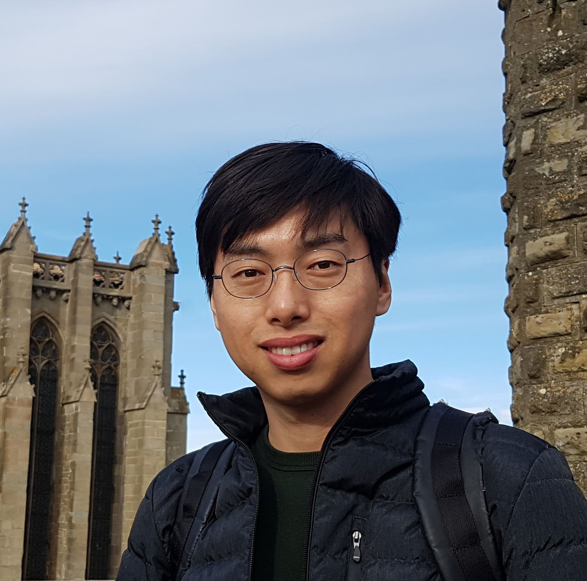
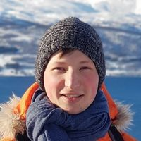
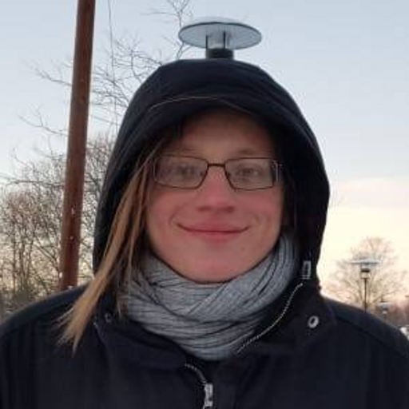
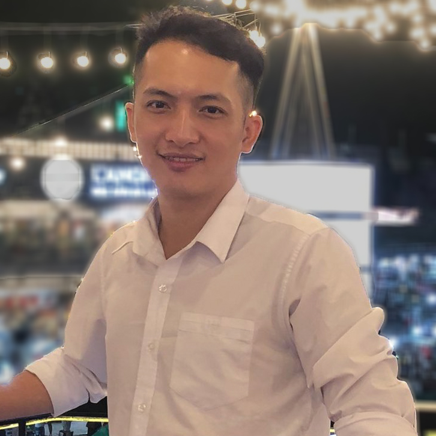
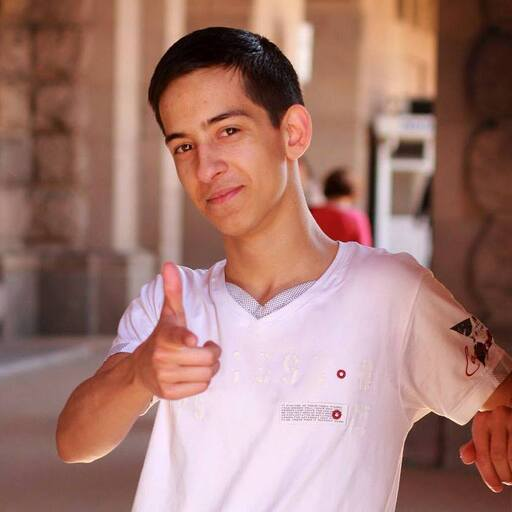
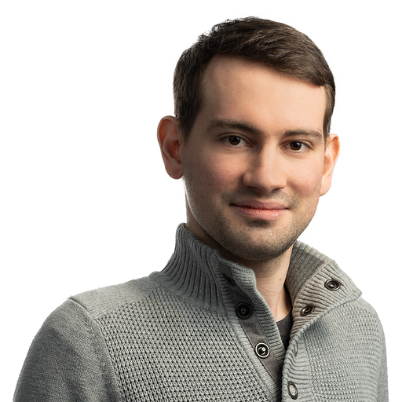
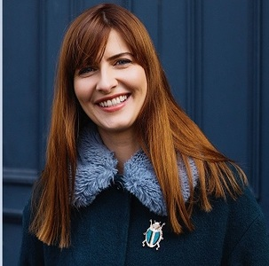
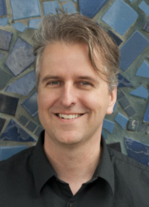
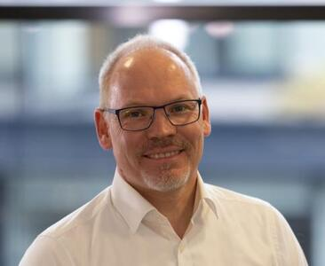

<h1 style="color: #3979c0">Who are we?</h1>
Our international team includes **leading experts on the evaluation of gesture-generation models**, as well as **experienced model developers** and **research engineers** with experience in deploying gesture-generation models.
Together, we are developing the leaderboard and its associated tooling, and we will be responsible for managing and funding year-round crowdsourced human evaluations.

Our cumulative experience covers **all major aspects of gesture-generation research**, including:
* <b>crowdsourced evaluation</b>: e.g., organising the GENEA Challenges in 2020-2024 (the leading large-scale human evaluation efforts in gesture generation to date!)
* <b>data collection</b>: e.g., <i>TED Gesture dataset</i>
* <b>model development</b>: e.g., <i>Gesticulator</i> (ICMI 2020 Best paper), <i>Gesture Generation from Trimodal Context</i> (SIGGRAPH Asia 2020), <i>StyleGestures</i> (EUROGRAPHICS 2020 Honourable mention), <i>Listen, Denoise, Action!</i> (SIGGRAPH 2023), <i>AQ-GT</i> (ICMI 2023 Best paper)
* <b>visualisation tooling</b>: e.g., Blender, Maya, and Unreal Engine development

--- 
<h3 style="color: #3979c0">Organising team</h3>
<!-- Picture row 1 -->

    

        

            
            

                <h5><a href="https://sites.google.com/view/youngwoo-yoon/">Youngwoo Yoon</a></h5>
                <h6>Principal Researcher</h6>
                <h6>ETRI, South Korea</h6>
            

        

    

  

        

            
            

                <h5><a href="https://svito-zar.github.io/">Taras Kucherenko</a></h5>
                <h6>Research Scientist</h6>
                <h6>Electronic Arts - SEED, Sweden</h6>
            

        

    

    

        

            
            

                <h5><a href="https://people.kth.se/~ghe/">Gustav Eje Henter</a></h5>
                <h6>Assistant Professor</h6>
                <h6>KTH Royal Institute of Technology</h6>
                <h6>Head of Research</h6>
                <h6>motorica.ai, Sweden</h6>
            

        

    

    

        

            
            

                <h5><a href="https://nagyrajmund.github.io/">Rajmund Nagy</a></h5>
                <h6>Doctoral Student</h6>
                <h6>KTH Royal Institute of Technology, Sweden</h6>
            

        

    

<!-- Picture row 2 -->

  

  

    
    

        <h5><a href="https://techfak.uni-bielefeld.de/~hvoss/">Hendric Voß</a></h5>
        <h6>Doctoral Student</h6>
        <h6>Bielefeld University, Germany</h6>
    

    

  

    

    

        
        

            <h5><a href="https://hmthanh.github.io/">Thanh Hoang-Minh</a></h5>
            <h6>MSc Student</h6>
            <h6>VNUHCM - University of Science, Vietnam</h6>
        

    

    

    

    

        
      

          <h5><a href="https://www.teonikolov.com/">Teodor Nikolov</a></h5>
          <h6>Research Engineer</h6>
          <h6>motorica.ai, Sweden</h6>
      

  

  

  

  

      
      

          <h5><a href="https://www.linkedin.com/in/mihailtsakov/">Mihail Tsakov</a></h5>
          <h6>Unreal Engine Developer</h6>
          <h6>PixelPool, Netherlands</h6>
      

  

  

---

<h3 style="color: #3979c0">Scientific advisors</h3>
While the organising team handles day-to-day operations, we are fortunate to be advised in key strategic decisions and the leaderboard methodology by three leading experts of <i>nonverbal communication, visual perception, human-agent interaction, and motion capture</i>:
 

  

    

        
        

            <h5><a href="https://www.scss.tcd.ie/rachel.mcdonnell/">Rachel McDonnell</a></h5>
            <h6>Trinity College Dublin, Ireland</h6>
        

    

    

        
        

            <h5><a href="https://www.cs.ucdavis.edu/~neff/">Michael Neff</a></h5>
            <h6>University of California, Davis, USA</h6>
        

    

    

    

        
        

            <h5><a href="https://www.techfak.uni-bielefeld.de/~skopp/">Stefan Kopp</a></h5>
            <h6>Bielefeld University, Germany</h6>
        

    

